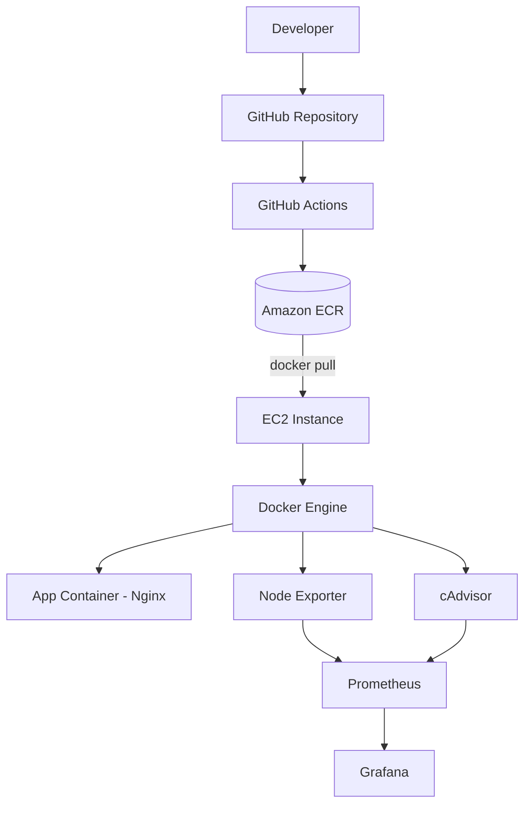
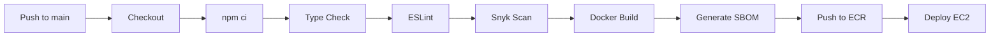

# 🚀 Proyecto Final Diplomado DevOps  
## CI/CD Seguro para Aplicación Containerizada en AWS  

### MundosE – DevOps2502 – Grupo 8  
- Escalante, Eliany  
- Rada, Carlos  
- Zeledon, Silvia  

---

  
  
  
  
  

---

# 1. Descripción General

Pipeline completo de Integración Continua y Entrega Continua (CI/CD) para una SPA desarrollada con React + TypeScript + Vite, desplegada en AWS con prácticas DevSecOps y observabilidad completa.

---

# 2. Arquitectura General

## Diagrama de Arquitectura AWS

---

# 3. Pipeline CI/CD

## Diagrama del Pipeline

---

# 4. Seguridad

- ESLint
- TypeScript
- Snyk (dependencias + imagen Docker)
- SBOM CycloneDX con Syft
- GitHub Secrets
- IAM Role en EC2

---

# 5. Infraestructura AWS

- EC2 t2.micro (Free Tier)
- Amazon ECR privado
- Docker Engine
- Prometheus + Node Exporter + cAdvisor + Grafana

---

# 6. Observabilidad

Monitoreo de CPU, memoria, disco, red y estado de contenedores mediante Prometheus y dashboards personalizados en Grafana.

---

# 7. Conclusión

Arquitectura automatizada, segura y monitoreada que integra CI/CD, DevSecOps, infraestructura cloud y observabilidad completa.
